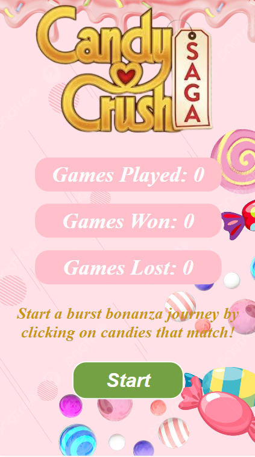
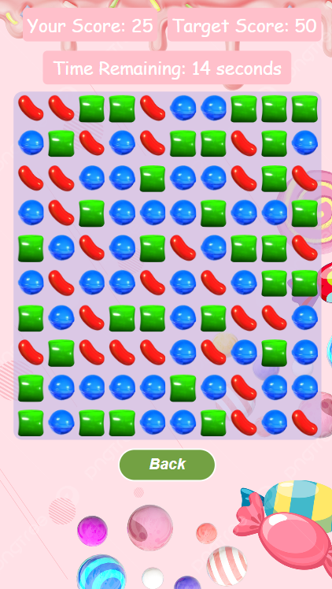
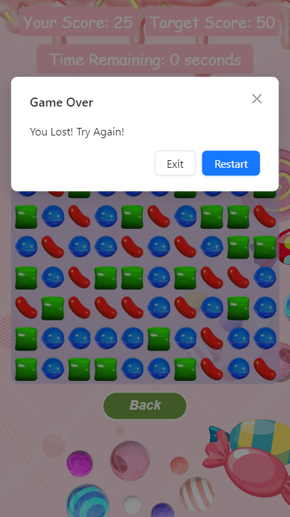

# Candy Crush Game

A simple Candy Crush game implemented in React.

## Introduction

This project is a Candy Crush game implemented using React.
It provides a simple, delightful and responsive gaming experience that brings the classic match-and-score fun to both web and mobile platforms

## Hosted Link

https://candy-crush-clone-sp.netlify.app/

## Features

- Responsive design to ensure an optimal gaming experience across various screen sizes
- Dynamic grid of candies that can be clicked to create matches
- Score tracking to monitor the player's progress
- Time limit to add an element of challenge
- Modal messages for game outcomes (win or lose)
- Keep track of your gaming statistics:
  - Total number of games played
  - Number of games won
  - Number of games lost

## Getting Started

### Prerequisites

- [Node.js](https://nodejs.org/) installed on your machine.

### Installation

1. Clone the repository:
   git clone https://github.com/suryaspandey/CandyCrushCloneAssignment.git
2. Navigate to the project directory:
   cd CandyCrushClone
3. Install dependencies:
   npm install

### Running the Game

    npm run dev

### Gameplay

- Click on a group of three or more candies of the same type to burst the candies
- 1 point is earned for each candy burst within the cluster
- Achieve the target score within the time limit to win the game
- If the time limit is reached without reaching the target score, the game is lost

### Screenshots

- Home Screen

  

- Game Screen

  

- Game Result Modal

  

### Technologies Used

- React
- Redux
- HTML, CSS
- JavaScript
